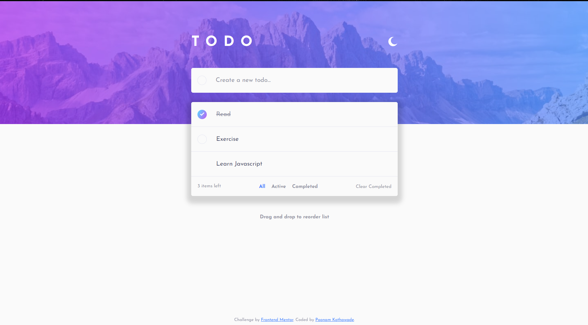

# Frontend Mentor - Todo app solution

This is a solution to the [Todo app challenge on Frontend Mentor](https://www.frontendmentor.io/challenges/todo-app-Su1_KokOW). Frontend Mentor challenges help you improve your coding skills by building realistic projects. 

## Table of contents

- [Overview](#overview)
  - [The challenge](#the-challenge)
  - [Screenshot](#screenshot)
  - [Links](#links)
- [My process](#my-process)
  - [Built with](#built-with)
  - [What I learned](#what-i-learned)
  - [Continued development](#continued-development)
- [Author](#author)

## Overview

### The challenge

Users should be able to:

- View the optimal layout for the app depending on their device's screen size
- See hover states for all interactive elements on the page
- Add new todos to the list
- Mark todos as complete
- Delete todos from the list
- Filter by all/active/complete todos
- Clear all completed todos
- Toggle light and dark mode
- **Bonus**: Drag and drop to reorder items on the list

### Screenshot

### Links

- Solution URL: [https://github.com/Poonamkothawade25/fem-todo-app-theme-toggle-javascript]
- Live Site URL: [https://poonamkothawade25.github.io/fem-todo-app-theme-toggle-javascript/]

## My process

### Built with

- Semantic HTML5 markup
- CSS custom properties
- Flexbox
- Desktop-first workflow
- Local storage
- CSS border image and mask properties
- CSS transitions
- dragover, dragstart, dragend events
- insertBefore & getBoundingClientRect methods 
- reduce function

### What I learned

- I learned how to add gradient as border using border image property and mask for giving it border radius.
- How to store data in local storage using getItem and setItem methods of local storage.
- How to make elements draggable and be able to reorder them.

### Continued development

- Adding active color state to All, Active and completed buttons.
- Making the page responsive.

## Author

- Frontend Mentor - [@Poonamkothawade25](https://www.frontendmentor.io/profile/Poonamkothawade25)
